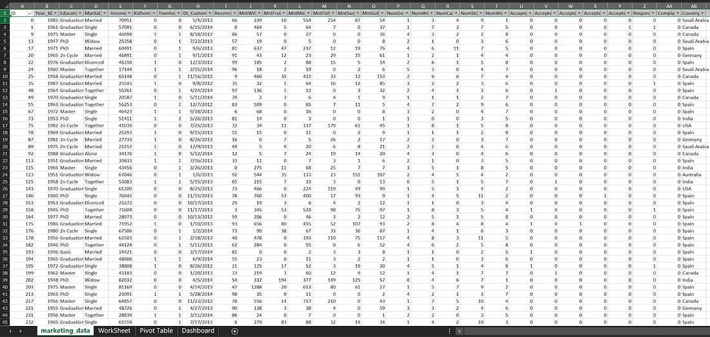
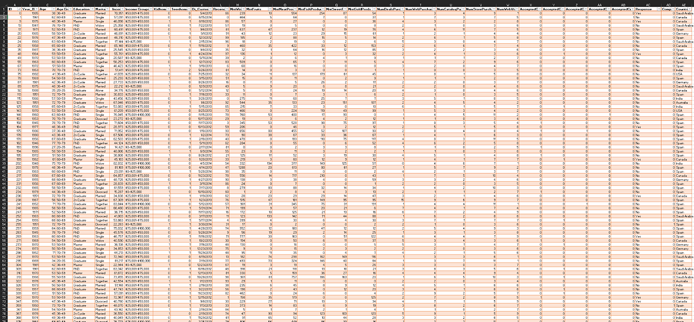
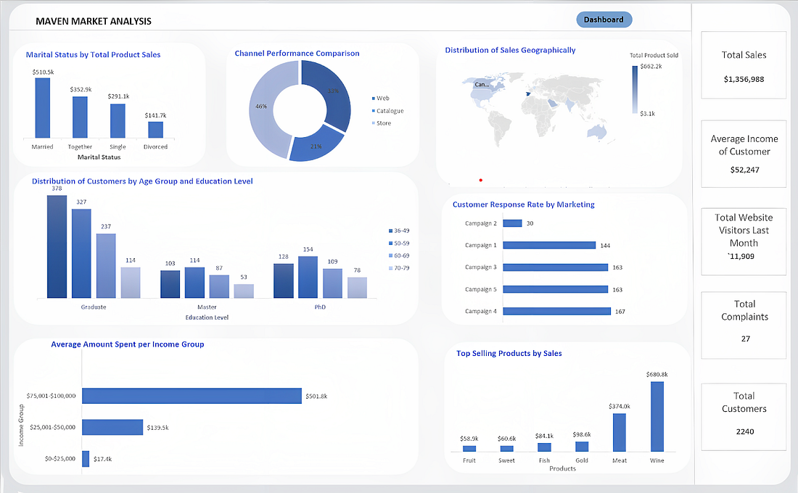
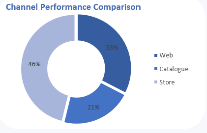
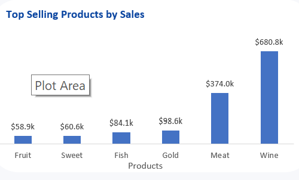
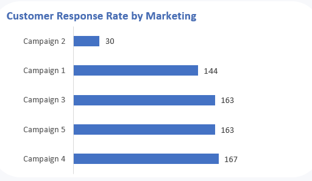
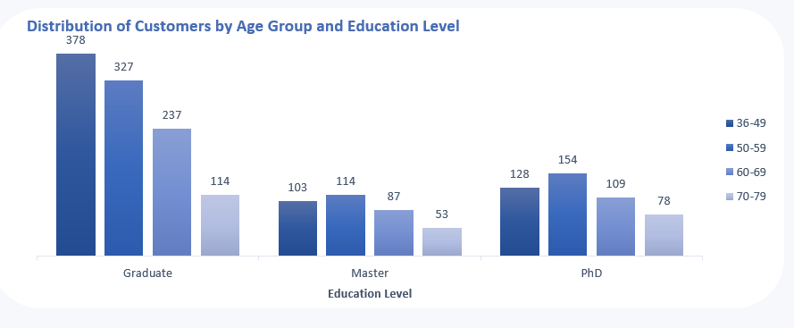
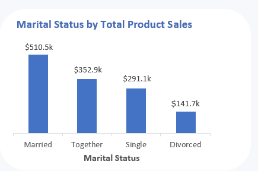

# Hidden Insights: A Comprehensive Market Analysis for Maven Marketing Company Using Data Analytics Techniques
____

___

## Introduction
I'm Abbas Abdulmalik Olatunde, a Chemistry graduate turned data enthusiast. I'm passionate about uncovering the stories hidden in numbers and using data to solve complex problems. As the famous data scientist William Edwards Deming once said, "In God we trust, all others must bring data." So, let's dive into the world of data and discover the insights waiting to be uncovered!

## Project

In today's data-driven world, it's not enough to simply collect data; we must be able to mine it for insights and use it to make informed decisions. That's exactly what this project aims to achieve for Maven Marketing company - to turn their big data into pure gold.

I will be conducting a comprehensive market analysis to answer a multitude of questions using advanced data analytics techniques. I'll be diving deep into the data to uncover hidden patterns and trends, revealing insights that can help Maven Marketing make informed decisions and stay ahead of the competition.

From analyzing consumer behavior to identifying market trends, my goal is to leave no stone unturned in our quest for valuable insights. By the end of this project, we hope to have provided Maven Marketing with a comprehensive report detailing our findings and recommendations.

The tool I used to perform this analysis is **Microsoft Excel.**

## Case Study
With a database of 2,240 customers, there's a wealth of information waiting to be uncovered. The datasets include a variety of key metrics, including Customer Profiles, Product Preferences, Campaign Successes/Failures, and Channel Performance. 

As a Data Analyst, your role is to dive deep into this data, analyze it thoroughly, and seek out valuable insights to help Maven Marketing achieve its objectives. From identifying customer segments to understanding campaign effectiveness, your analysis will be crucial in informing business decisions and driving growth. You'll need to use your skills in advanced analytics and data visualization to uncover patterns, trends, and insights that will provide Maven Marketing with a competitive edge.

## Dataset Information
The genesis of this exciting dataset can be traced back to Tina Okonkwo, who provided it as a challenge (on Twitter - #LearnDataAnalyticsWithTina). Through her generosity, we now have a treasure trove of data that will help us unlock valuable insights and make informed business decisions.

## Data Analysis Process

In other to discover patterns in the raw data and draw valuable information from them, the set of procedures served as crucial steps for the successful completion of this project. They are;

1. Business Question
2. Data Gathering
3. Data Cleaning
4. Data Exploration
5. Data Visualization
6. Insight and Recommendation

## 1. Business Question

At the heart of the Maven Marketing market analysis are four key questions that the data set will help us answer. By analyzing the data, we hope to gain insights into:

1. The most successful marketing campaign: By examining the data on campaign successes and failures, we can identify which marketing campaigns have been most effective in engaging customers and driving sales.

2. The best-performing products: The data on product preferences will allow us to determine which products are most popular with our customers, and which ones may need improvement or further promotion.

3. The underperforming channels: The data on channel performance will give us a clear picture of which marketing channels are delivering the best results, and which ones may need to be adjusted or replaced.

4. The average customer profile: By analyzing the data on customer profiles, we can gain a better understanding of who our typical customer is, and what their needs and preferences are.

By answering these four questions, we hope to gain a comprehensive understanding of the marketing landscape for Maven Marketing and identify key areas where we can improve our marketing strategy to better meet the needs of our customers. So, let's get started with the analysis and see what insights we can uncover!

## 2. Data Gathering 
The dataset was gotten from Tina Okonkwo. The data was loaded into a zip file.  I unzipped it and the data was loaded into an Excel Worksheet. 

## 3. Data Assessment and Cleaning 
The data set was assessed for issues with its Quality and issues with its structure. The snap shot of the data is seen below.

After assessing the datasets, The appropriate steps were taken to clean the data. The steps are:

1. Checked for duplicate data, outliers, and blank cells in the dataset.
2. Removed any duplicate data points to ensure data accuracy and reliability.
3. Identified and addressed outliers to prevent them from skewing the results of data analysis.
4. Created a new column for Age Groups to group data based on age ranges for analysis or visualization purposes.
5. The age groups used were 20 - 35, 36 - 49, 50 - 59, 60 - 69, 70 - 79 & 80+.
6. Created a new column for Income Groups to group data based on Income ranges for analysis or visualization purposes.
7. The income groups used were Less than $25,000, $25,000 - $50,000, $50,000 - $75,000, $75,000 - $100,000, More than $100,000.
8. Converted the column of the Response to the last campaign to Yes/No.
9. Specifically, converted 0 to "No" and 1 to "Yes" to make it easier to understand the response rates of the campaign.
10. The new columns and the converted response column will be used for analysis and visualization purposes to gain insights into the data and make informed decisions based on the results.

The look of the cleaned data set is shown below:

## 4. Data Exploration

In this section, I used **pivot tables** and other Excel tools to explore the Maven Marketing dataset and answer the key business questions identified earlier. Pivot tables allowed us to quickly summarize and analyze the data, while charts and graphs helped to visualize the results in a more meaningful way.

For each business question, I first created a pivot table that summarized the relevant data. We then used the pivot table to identify trends and patterns, and created visualizations to help us better understand the data.

Here is a quick recap, the questions asked of the data are;

1. What channel has the best performance?
2. Which product is performing best?
3. Which marketing campaigns resulted in the highest number of customers?
4. What does the average customer look like?

## 5. Data Visualization
In this step, I created visualizations to translate the information gotten from the data in the pivot table into a visual context which makes it easier to communicate my findings.

The dashboard was created using **Microsoft Excel** is shown below;

## 6. Insights
Based on our exploration of the Maven Marketing dataset and additional research on this case study, I was able to uncover several key insights that shed light on the company's marketing performance. By analyzing the data and creating visualizations to help us better understand it, I was able to identify trends, patterns, and correlations that might not have been immediately apparent.

Some of the insights I discovered include:

### 1. What channel has the best performance?

Through my analysis of the Maven Marketing dataset, I was able to gain insights into the performance of the three channels used by the company: Web, Catalogue, and Store. After examining the data on sales and channel performance, I found that the Store channel was by far the most successful, contributing a significant 46% of the total sales.

In contrast, the Web channel contributed 33% of the total sales, while the Catalogue channel accounted for 21%. These findings suggest that the Store channel is a key driver of sales for Maven Marketing and that the company should consider investing more resources in this channel to further drive revenue growth.

### 2. Which product are performing best?

After analyzing the sales data for the Maven Marketing dataset, I found that the Wine and Meat categories were the best-performing products in terms of total sales. Specifically, the Wine category had the highest sales of approximately $680.8k, while the Meat category came in second with total sales of approximately $374.0k.

This insight could help Maven Marketing to focus on and prioritize these top-performing product categories in their marketing and sales strategies, potentially leading to further growth and success.

### 3. Which marketing campaigns resulted in the highest number of customers?

Upon analyzing the data, I found that Campaign 4 was the top-performing campaign in terms of customer acquisition, generating a total of 167 customers. Campaigns 5 and 3 were close behind, each generating 163 customers.

These findings suggest that Campaign 4 may have been particularly effective in attracting new customers, and Maven Marketing could consider investing more resources into this type of marketing campaign in the future.

### 4. What does the average customer look like?

Customer Age Group          | Marital Status
:--------------------------:|--------------------------:
 |  

Upon analyzing the customer data provided by Maven Marketing, I found that the average customer is typically married, with a graduate level of education, aged between 36-49, and has an average income between $50,001 - $75,000. Additionally, customers located in Spain tend to generate the highest sales for the company, with total sales of $622.2k.

## Recommendation

After gathering insights from the data, Here are my recommendations;
- Focus on optimizing the Store channel: Our analysis showed that the Store channel was by far the most successful in terms of driving sales for Maven Marketing. As such, we recommend that the company focus on optimizing this channel to further drive revenue growth. This could involve investing in in-store marketing initiatives, optimizing store layouts and product displays, and improving customer service to enhance the in-store experience.

- I recommend that Maven Marketing should consider increasing its marketing efforts for the Wine and Meat categories. This could involve creating targeted campaigns for these products, offering promotions or discounts, and highlighting them prominently in their marketing materials.

- Invest more resources into Campaign 4: Given that Campaign 4 was the most effective in generating new customers, it may be worth allocating additional resources to this campaign to further optimize its performance.

- Based on the finding that the average customer for Maven Marketing is married, a graduate, between the ages of 36-49, with an average income of $50,001-$75,000, and living in Spain, the company can tailor its marketing and sales strategies to target this demographic. Maven Marketing can develop campaigns and promotions that appeal specifically to this group of customers, such as offering discounts on products that are popular among this demographic or creating targeted social media campaigns. By focusing on this group, the company can potentially increase its sales and revenue. Additionally, the company may want to consider expanding its marketing efforts to other countries with similar demographics to further increase its customer base.

## Conclusion
I have successfully explored and analyzed the Maven Marketing dataset using Excel. Through the use of pivot tables and visualization, we were able to answer business questions and provide insights and recommendations based on the data.

We found that the top-performing product categories were Wine and Meat, while the store channel was the most successful in generating sales. Additionally, we discovered that the average customer for Maven Marketing is a married graduate between the ages of 36-49 with an income of $50,001 - $75,000 who lives in Spain.

Based on these insights, we provided recommendations for Maven Marketing to focus on and prioritize the top-performing product categories and consider expanding their marketing efforts in the store channel and targeting customers who fit the average customer profile.

